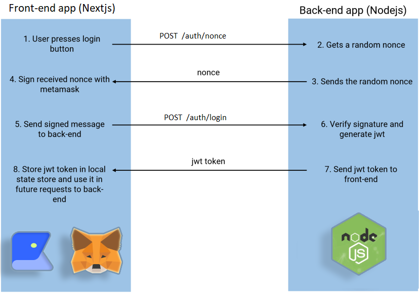

# klaytn-dapp-kit

Boiler plate code for signing and authentication. The repository has the structure and template to connect to multiple wallets using [web3modal](https://github.com/klaytn/klaytn-web3modal). 
  
1. **sign** 
Signing module has a frontend and backend boiler plate code with signing and authentication feature. Using this module you can, 
    - sign a message using the wallet.
	- verify the message from frontend
	- verify the message from backend

Refer to [README](sign/README.md) section for step by step instructions to sign and authenticate

2. **authenticate**
Authenticate module has a frontend and backend boiler plate code to sign, verify a message using a nonce and JWT token. Frontend will sign the message using response generated nonce .Backend will verify the signature and generate a jwt token for the front end dapp to communicate with the backend. 
	- register and login user address

Refer to [README](authenticate/README.md) section for step by step instructions to sign and authenticate

3. **fee delegation**
Fee Delegation has a frontend and backend boiler plate code to sign with deployer and fee payer. Frontend will sign the transaction with deployer kaikas account .Backend will send the transaction from fee payer for the signed transaction by deployer from frontend. 
	- sample contract deployment with deployer and fee payer

Refer to [README](feedelegation/README.md) section for step by step instructions to perform transaction with deployer and feedeployer
	